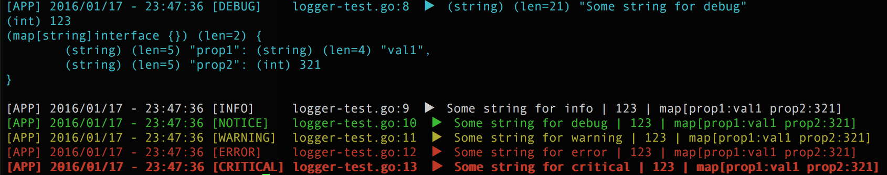

# go-logger
Simple logger library for golang.
Colorizing, timestamping and on Debug output vars with additional info

## Installation

```go
    go get -u github.com/ivahaev/go-logger
```

## Usage

```go
    import "github.com/ivahaev/go-logger"
```

## Example

```go
    package main

    import "github.com/ivahaev/go-logger"

    func main() {
        logger.SetLevel("DEBUG")

        logger.Debug("Some string for debug", 123, map[string]interface{}{"prop1": "val1", "prop2": 321})
        logger.Info("Some string for info", 123, map[string]interface{}{"prop1": "val1", "prop2": 321})
        logger.Notice("Some string for debug", 123, map[string]interface{}{"prop1": "val1", "prop2": 321})
        logger.Warn("Some string for warning", 123, map[string]interface{}{"prop1": "val1", "prop2": 321})
        logger.Error("Some string for error", 123, map[string]interface{}{"prop1": "val1", "prop2": 321})
        logger.Crit("Some string for critical", 123, map[string]interface{}{"prop1": "val1", "prop2": 321})
    }
```

Output will be:




#### func  Crit

```go
func Crit(v ...interface{})
```
Crit logs provided arguments to console when level is CRIT, ERROR, WARN, NOTICE,
INFO or DEBUG.

#### func  Debug

```go
func Debug(v ...interface{})
```
Debug logs provided arguments to console with extra info. Works only when level
sets to DEBUG (default)

#### func  Error

```go
func Error(v ...interface{})
```
Error logs provided arguments to console when level is ERROR, WARN, NOTICE, INFO
or DEBUG.

#### func  Info

```go
func Info(v ...interface{})
```
Info logs provided arguments to console when level is INFO or DEBUG.

#### func  Notice

```go
func Notice(v ...interface{})
```
Notice logs provided arguments to console when level is NOTICE, INFO or DEBUG.

#### func  SetLevel

```go
func SetLevel(level string) error
```
SetLevel sets level of logging. level can be "CRIT", 'ERROR', 'WARN', "NOTICE",
"INFO" or "DEBUG"

#### func  Warn

```go
func Warn(v ...interface{})
```
Warn logs provided arguments to console when level is WARN, NOTICE, INFO or
DEBUG.
